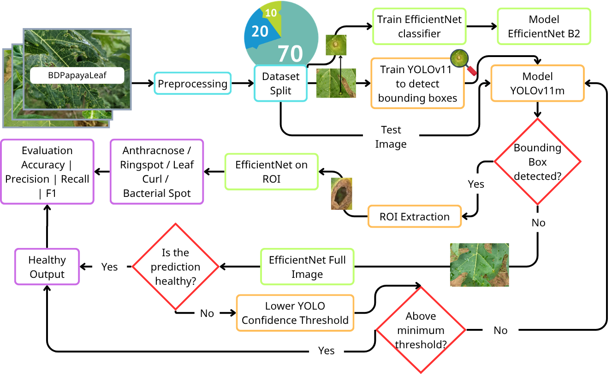
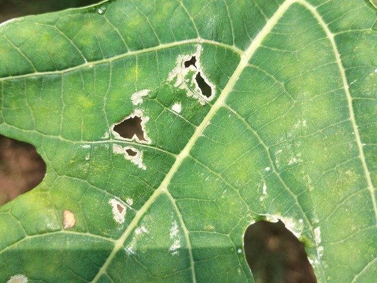
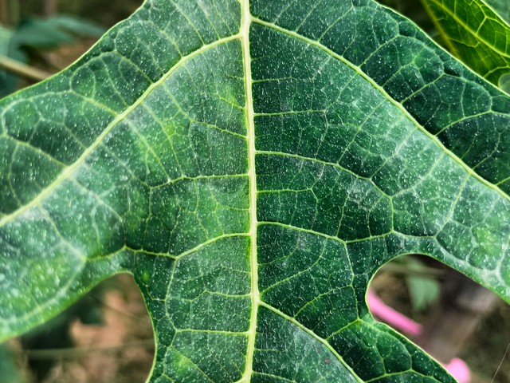
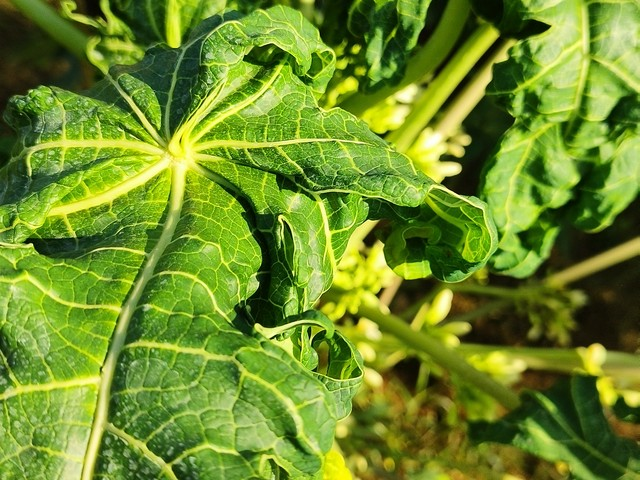
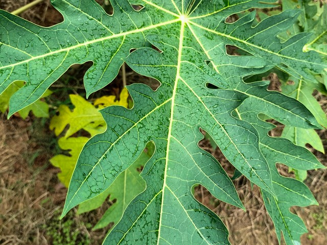
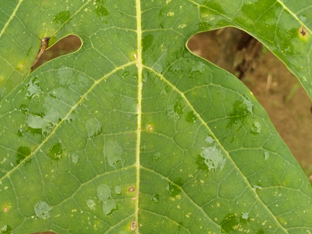

# Papaya Leaf Disease Detection and Classification

Two-stage deep learning cascade for papaya leaf disease detection and classification. The first stage uses YOLOv11 to localize diseased leaf regions, and the second stage uses EfficientNetB2 to classify the cropped regions into five classes:

- Anthracnose
- Bacterial Spot
- Leaf Curl
- Healthy
- Ring Spot

This repository was reorganized from Google Colab training artifacts into a GitHub-ready project structure.

## Overview

<p align="center">
  
</p>

## Highlights

- Built a YOLOv11 -> CNN cascade to reduce background noise before classification.
- Evaluated YOLOv11n, YOLOv11s, and YOLOv11m as disease-region detectors.
- Compared EfficientNetB0/B1/B2 and baseline CNN backbones including DenseNet121, ResNet50, and VGG16.
- Best cascade: YOLOv11m + EfficientNetB2.

## Sample Classes

<table>
  <tr>
    <td align="center"><br><b>Anthracnose</b></td>
    <td align="center"><br><b>Bacterial Spot</b></td>
    <td align="center"><br><b>Leaf Curl</b></td>
    <td align="center"><br><b>Healthy</b></td>
    <td align="center"><br><b>Ring Spot</b></td>
  </tr>
</table>

## Key Results

| Experiment | Test set | Accuracy | Macro precision | Macro recall | Macro F1 |
| --- | ---: | ---: | ---: | ---: | ---: |
| Full-image EfficientNetB2 baseline | 291 images | 92.78% | 93.17% | 92.86% | 92.93% |
| YOLOv11m + VGG16 | 291 images | 93.47% | 92.88% | 94.23% | 93.28% |
| YOLOv11m + DenseNet121 | 291 images | 94.16% | 93.72% | 94.73% | 94.09% |
| YOLOv11m + ResNet50 | 291 images | 94.50% | 93.93% | 94.76% | 94.26% |
| YOLOv11m + EfficientNetB2 | 291 images | 94.85% | 94.92% | 94.93% | 94.92% |

YOLOv11m detector test metrics: precision 80.24%, recall 81.62%, mAP@0.5 77.67%, and mAP@0.5:0.95 65.20%.

More details are in [docs/RESULTS.md](docs/RESULTS.md).

## Repository Structure

```text
.
|-- data/
|   |-- annotations/yolo_bbox/      # YOLO label files by disease class
|   `-- reports/preprocessing/      # data cleaning and split reports
|-- docs/
|   |-- DATASET.md
|   |-- RESULTS.md
|   `-- paper/                      # project paper draft
|-- notebooks/
|   |-- 01_data_preparation.ipynb
|   |-- 02_train_yolov11_detector.ipynb
|   |-- 03_train_efficientnet_b0_classifier.ipynb
|   |-- 04_train_efficientnet_b1_classifier.ipynb
|   |-- 05_train_efficientnet_b2_classifier.ipynb
|   |-- 06_evaluate_yolov11_efficientnet_cascade.ipynb
|   `-- baselines/
|-- outputs/
|   |-- cnn/
|   |-- cnn_baselines/
|   |-- cnn_full_image_baselines/
|   |-- pipeline_evaluation/
|   |-- pipeline_evaluation_baselines/
|   `-- yolo/
|-- requirements.txt
`-- README.md
```

## Workflow

1. Prepare and clean the BDPapayaLeaf dataset with `notebooks/01_data_preparation.ipynb`.
2. Train YOLOv11 disease-region detectors with `notebooks/02_train_yolov11_detector.ipynb`.
3. Train CNN classifiers with `notebooks/03_*` through `notebooks/05_*`.
4. Evaluate the full cascade with `notebooks/06_evaluate_yolov11_efficientnet_cascade.ipynb`.
5. Use `notebooks/baselines/` for full-image and alternative-backbone experiments.

The notebooks were exported from Google Colab. Before rerunning them locally, update the Colab-specific paths such as `/content/drive/MyDrive/Papaya_Leaf_Disease_Classification`.

## Setup

```powershell
python -m venv .venv
. .\.venv\Scripts\Activate.ps1
pip install -r requirements.txt
```

For GPU training, install TensorFlow/PyTorch builds that match your CUDA environment.

## Data and Checkpoints

The original image dataset is not included in this downloaded repository. YOLO annotation files and preprocessing reports are kept under `data/`.

Trained checkpoints are stored locally under `outputs/`, but `*.keras` and `*.pt` files are ignored by `.gitignore` because several files are too large for normal GitHub uploads. Mail uni.pdq@gmail.com for more!
